# Implementation-of-SVM-For-Spam-Mail-Detection

## AIM:
To write a program to implement the SVM For Spam Mail Detection.

## Equipments Required:
1. Hardware – PCs
2. Anaconda – Python 3.7 Installation / Jupyter notebook

## Algorithm
1. Import the necessary python packages using import statements.
2. Read the given csv file using read_csv() method and print the number of contents to be displayed using df.head().
3. Split the dataset using train_test_split.
4. Calculate Y_Pred and accuracy.
5. Print all the outputs.
6. End the Program.
## Program:
```
/*
Program to implement the SVM For Spam Mail Detection..
Developed by: BHAVATHARANI S
RegisterNumber:  212223230032
*/
```

## Output:
```
import pandas as pd
data=pd.read_csv("/content/spam.csv",encoding='Windows-1252')
data.head()
```
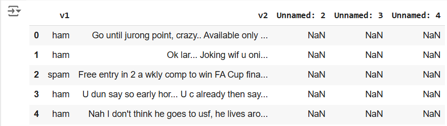
```
data.tail()
```
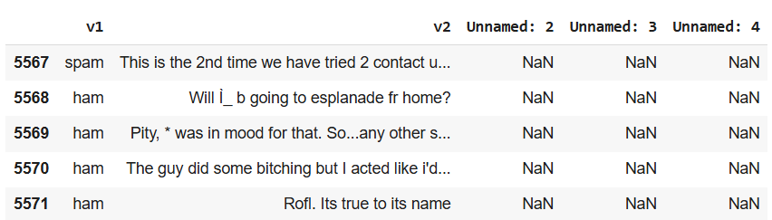
```
data.info()
```
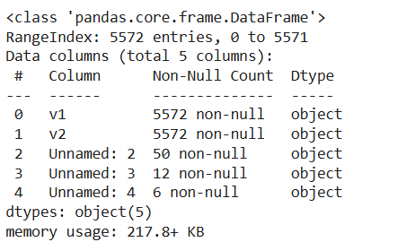
```
data.isnull().sum()
```
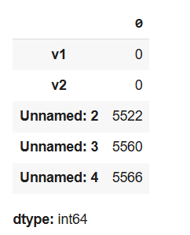
```
x=data['v2'].values
y=data['v1'].values
```
```
y.shape
```
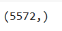
```
x.shape
```
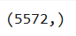
```
from sklearn.model_selection import train_test_split
x_train,x_test,y_train,y_test=train_test_split(x,y,test_size=0.2,random_state=0)
x_train.shape
```
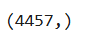
```
y_train.shape
```

```
x_test.shape
```
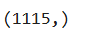
```
from sklearn.feature_extraction.text import CountVectorizer
cv = CountVectorizer()
x_train = cv.fit_transform(x_train)  
x_test = cv.transform(x_test)
```
```
x_train.shape
```
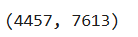
```
from sklearn.svm import SVC
svc=SVC()
svc.fit(x_train,y_train)
y_pred=svc.predict(x_test)
y_pred 
```
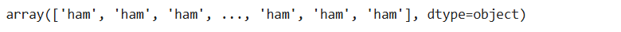
```
from sklearn import metrics
accuracy=metrics.accuracy_score(y_test,y_pred)
accuracy
```
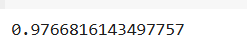

## Result:
Thus the program to implement the SVM For Spam Mail Detection is written and verified using python programming.
